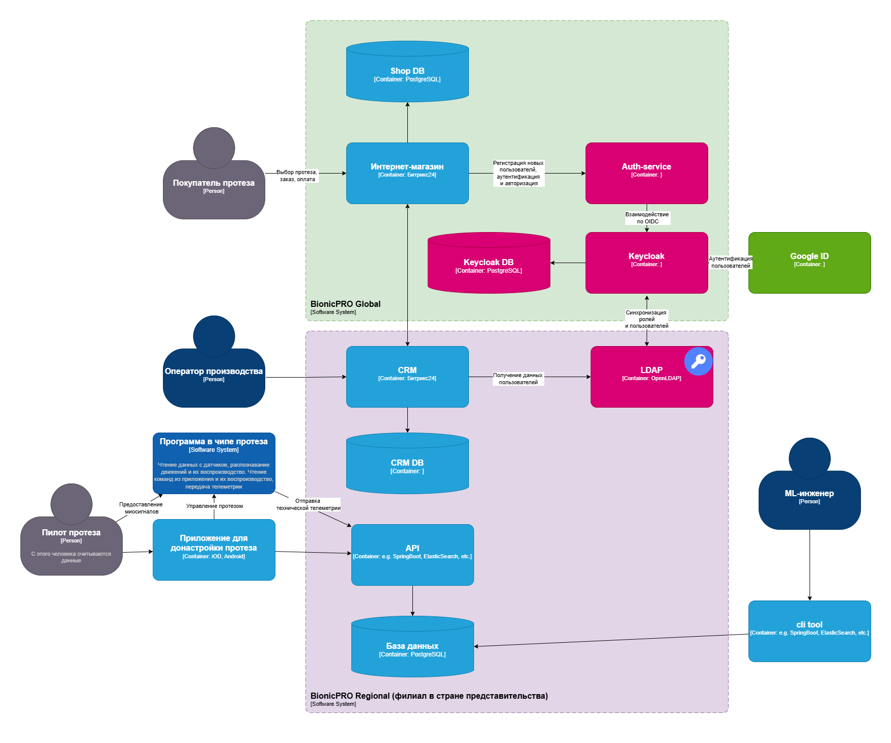

# Задание 1. Повышение безопасности системы
## Задача 1. Предложите архитектурное решение и доработайте диаграмму C4 для управления учётными данными пользователя. 

- BionicPRO разделён на глобальный и локальные подразделения.
- Медицинская и персональная информация хранятся в филиале представительства страны в соответсвии с местным законодательством.
- KeyCloak(IAM) обращается при аутентификации к региональным системам
- После успешной авторизации генерируется пара access token + refresh token, с которыми происходит обращение к нужным ресурсам.
- Добавлена аутентификация пользователей через различные внешние удостоверяющие службы, действующие в разных странах( например Google ID)

## Задача 2. Улучшите безопасность существующего приложения, заменив Code Grant на PKCE. 
