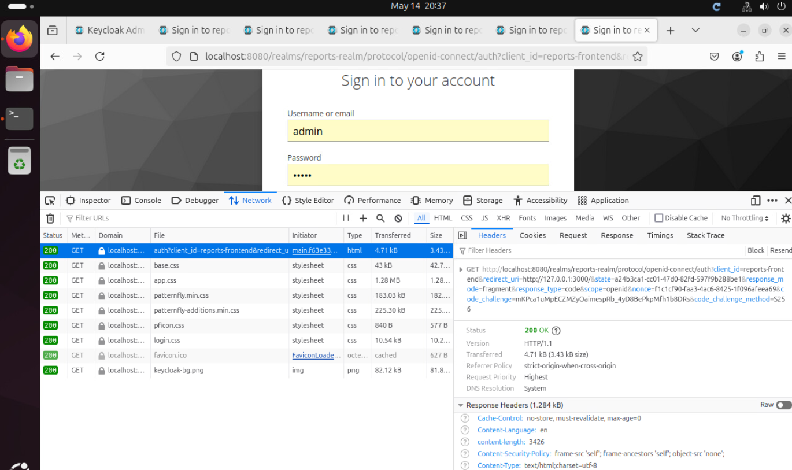
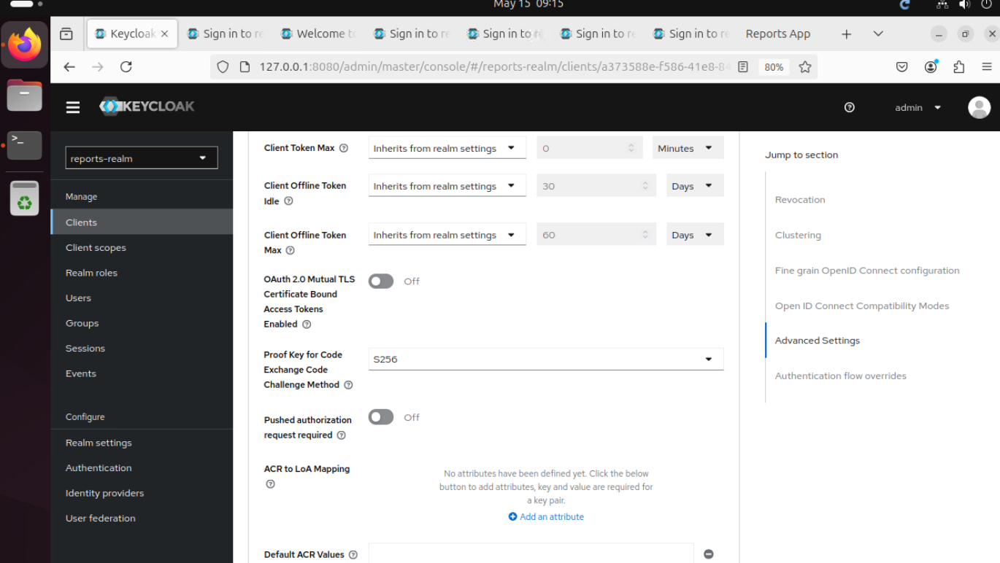

# Задание 1. Повышение безопасности системы
## Задача 1. Предложите архитектурное решение и доработайте диаграмму C4 для управления учётными данными пользователя. 

- BionicPRO разделён на глобальный и локальные подразделения.
- Медицинская и персональная информация хранятся в филиале представительства страны в соответствии с местным законодательством.
- KeyCloak(IAM) обращается при аутентификации к региональным системам.
- После успешной авторизации генерируется пара access token + refresh token, с которыми происходит обращение к нужным ресурсам.
- Добавлена аутентификация пользователей через различные внешние удостоверяющие службы, действующие в разных странах (например, Google ID).


## Задача 2. Улучшите безопасность существующего приложения, заменив Code Grant на PKCE. 
В настройках keycloak - realm-export.json для клиента установлены атрибуты PKCE:  
**"pkce.code.challenge.method": "S256"**  
```
    "clients": [
      {
        "clientId": "reports-frontend",
        "enabled": true,
        "publicClient": true,
        "redirectUris": ["http://localhost:3000/*"],
        "webOrigins": ["http://localhost:3000"],
        "directAccessGrantsEnabled": true,
        "attributes": {
          "pkce.code.challenge.method": "S256"
        }
        
      },
```

В коде Frontend донастроил работу с keycloak на использование PKCE(S256)  
```
export const initOptions = {
  onLoad: 'check-sso',                      // perform a silent session
  pkceMethod: 'S256',                       // enforce PKCE for extra SPA security
  silentCheckSsoRedirectUri: `${window.location.origin}/silent_pkce.html`,
};
```

При работе с фронтом в момент обращения к SSO в devtools можно убедиться в наличии в запросе редиректа:
code_challenge_method=S256 и кода cod_challenge.  


В UI Keycloak в настройках для клиента reports-frontend появилось требование  
**Proof Key for Code Exchange Code Challenge Method = S256**.  

