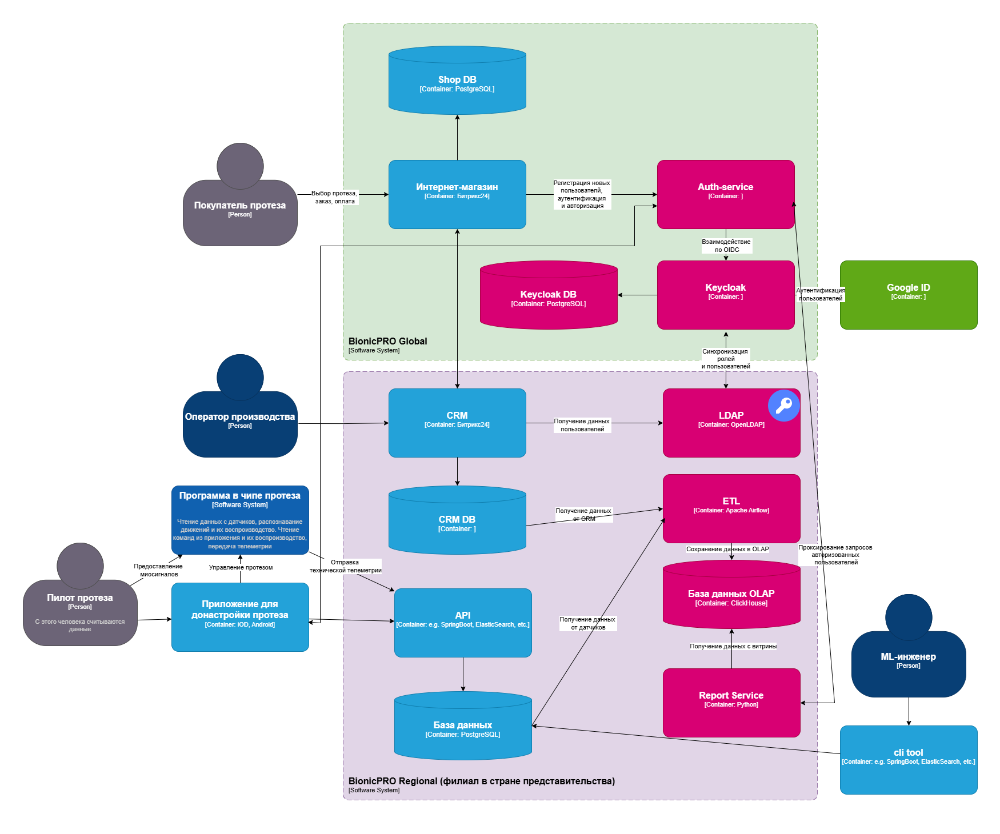
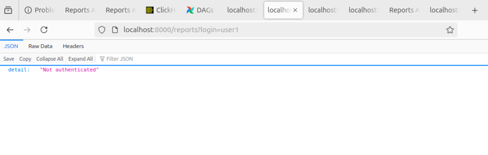
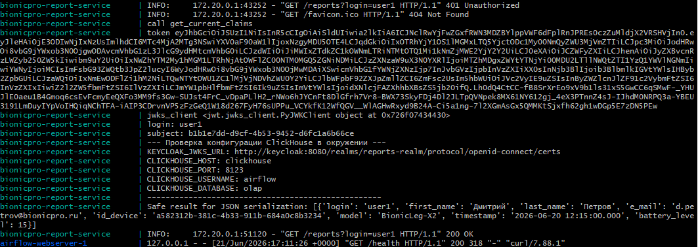
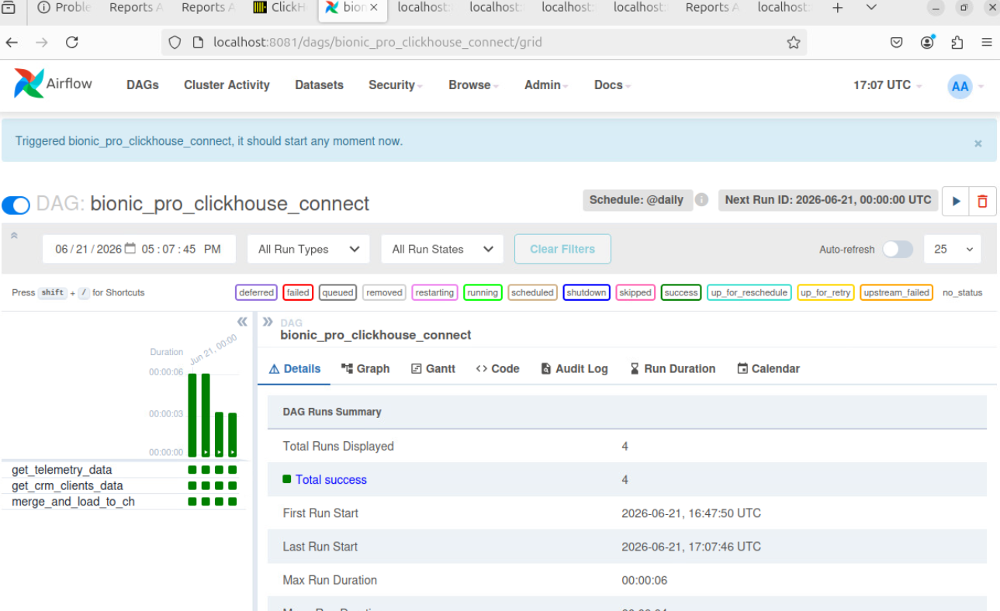
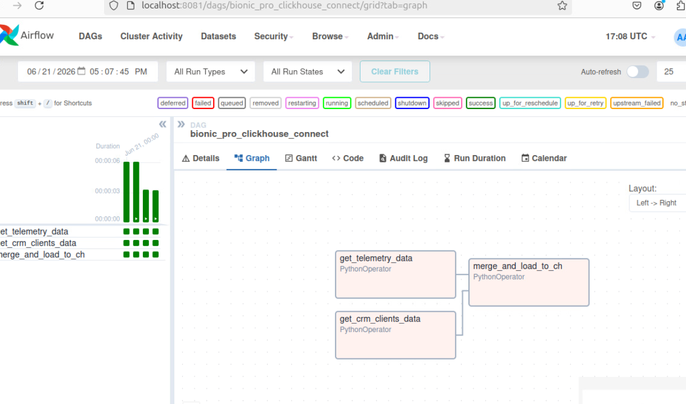
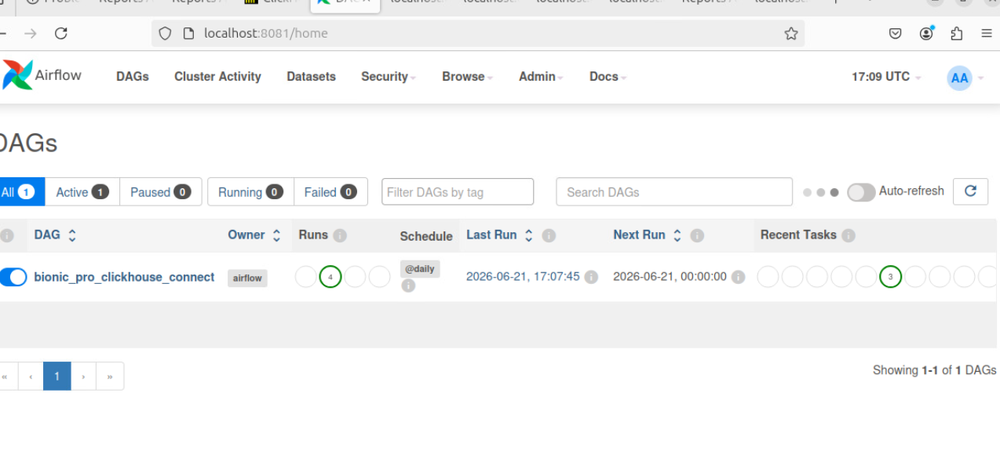
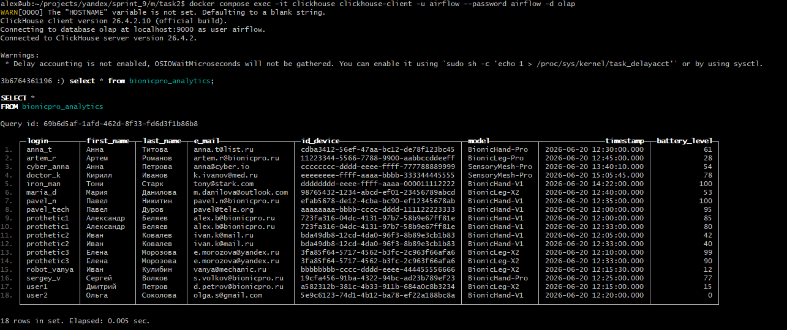
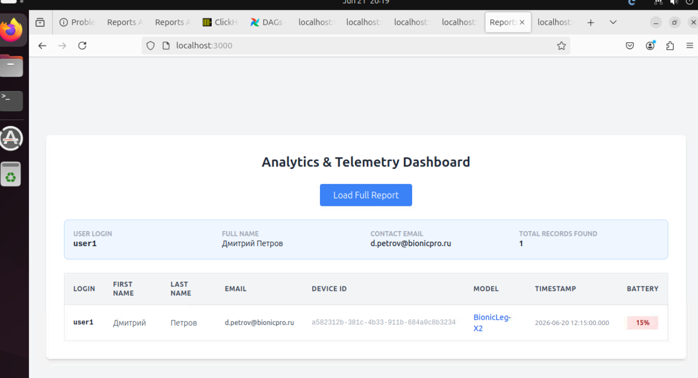
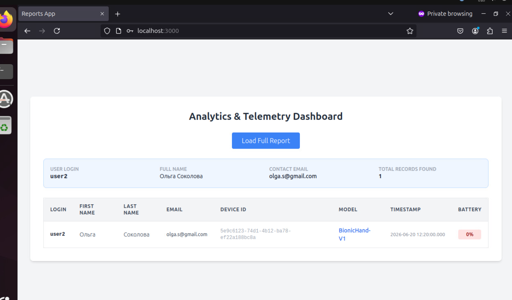

# Задание 2. Разработка сервиса отчётов
## Задача 1. Создать архитектуру решения для подготовки и получения отчётов.

Скрины с данными:  

Попытка получить доступ неавторизованным пользователем:  

Логи с сервиса отчетов для неавторизованного и авторизованного доступа:  

Результаты запусков ETL:  

Граф для графа:  

Показано расписание выполнения - ежедневно в 00:00(daily):  

Данные с clickhouse, имитирующие OLAP:  

Результаты запросов для пользователя user1:  

Результаты запросов для пользователя user2:  

